# Database design

PostgreSQL in production; SQLite locally so a fresh clone runs with no services
to install. `DATABASE_URL` selects between them.

## Conventions

Every domain table inherits `apps.core.models.BaseModel`:

| Column | Purpose |
| --- | --- |
| `id` | UUID primary key — ids are safe to expose in URLs and do not leak row counts |
| `created_at` / `updated_at` | Audit timestamps, indexed on `created_at` |
| `created_by` / `updated_by` | Actor tracking, `SET NULL` so history survives user deletion |
| `is_deleted` / `deleted_at` | Soft delete. The default manager hides deleted rows; `all_objects` sees them |

`AuditLog` is the deliberate exception: append-only, no soft delete, and its
`save()`/`delete()` raise on any attempt to modify history.

## Entity relationship diagram

```mermaid
erDiagram
    DEPARTMENT ||--o{ PROGRAM : offers
    DEPARTMENT ||--o{ COURSE : owns
    DEPARTMENT ||--o{ USER : employs
    DEPARTMENT ||--o{ ATTENDANCE_POLICY : configures

    PROGRAM ||--o{ BATCH : admits
    PROGRAM ||--o{ CURRICULUM_ITEM : defines
    ACADEMIC_SESSION ||--o{ SEMESTER : contains
    ACADEMIC_SESSION ||--o{ HOLIDAY : declares

    USER ||--o| STUDENT_PROFILE : has
    USER ||--o| FACULTY_PROFILE : has
    USER ||--o| SCHOLAR_PROFILE : has
    USER ||--o| ALUMNI_PROFILE : has
    ROLE_PERMISSION }o--|| USER : "grants via role"

    COURSE ||--o{ COURSE_SECTION : "delivered as"
    SEMESTER ||--o{ COURSE_SECTION : schedules
    BATCH ||--o{ COURSE_SECTION : attends
    COURSE_SECTION ||--o{ FACULTY_ASSIGNMENT : "taught by"
    COURSE_SECTION ||--o{ ENROLLMENT : enrols
    USER ||--o{ ENROLLMENT : "enrolled in"
    USER ||--o{ FACULTY_ASSIGNMENT : teaches

    COURSE_SECTION ||--o{ ATTENDANCE_SESSION : holds
    ATTENDANCE_SESSION ||--o{ ATTENDANCE_RECORD : records
    USER ||--o{ ATTENDANCE_RECORD : "marked in"
    USER ||--o{ ATTENDANCE_ALERT : receives

    COURSE_SECTION ||--o{ ASSESSMENT_COMPONENT : "assessed by"
    ASSESSMENT_COMPONENT ||--o{ COMPONENT_SCORE : scores
    USER ||--o{ COMPONENT_SCORE : earns
    USER ||--o{ EXTERNAL_MARK : earns
    COURSE_SECTION ||--o{ EXTERNAL_MARK : "examined in"
    COURSE_SECTION ||--o{ COURSE_RESULT : produces
    USER ||--o{ COURSE_RESULT : achieves
    GRADE_SCALE ||--o{ GRADE_BAND : "bounded by"

    COURSE_SECTION ||--o{ ASSIGNMENT : sets
    ASSIGNMENT ||--o{ ASSIGNMENT_SUBMISSION : receives
    USER ||--o{ ASSIGNMENT_SUBMISSION : submits
    ASSESSMENT_COMPONENT ||--o{ ASSIGNMENT : "feeds grade into"

    COURSE ||--o{ NOTE : documents
    NOTE ||--o{ NOTE_VERSION : versions
    NOTE ||--o{ NOTE_ACCESS_LOG : tracks
    COURSE ||--o{ QUESTION_TOPIC : organises
    QUESTION_TOPIC ||--o{ QUESTION : groups
    QUESTION ||--o{ QUESTION_OPTION : offers

    DEPARTMENT ||--o{ ANNOUNCEMENT : publishes
    ANNOUNCEMENT ||--o{ ANNOUNCEMENT_READ : "read by"
    USER ||--o{ NOTIFICATION : receives
    USER ||--o{ NOTIFICATION_PREFERENCE : configures
    USER ||--o| DIGEST_SUBSCRIPTION : subscribes
    CALENDAR_EVENT ||--o{ EVENT_REGISTRATION : "registered by"

    COURSE_SECTION ||--o{ DISCUSSION_THREAD : hosts
    DISCUSSION_THREAD ||--o{ DISCUSSION_REPLY : collects
    DISCUSSION_REPLY ||--o{ REPLY_VOTE : "voted on"

    FEEDBACK_FORM ||--o{ FEEDBACK_QUESTION : asks
    FEEDBACK_FORM ||--o{ FEEDBACK_RESPONSE : collects
    FEEDBACK_RESPONSE ||--o{ FEEDBACK_ANSWER : contains
    FEEDBACK_FORM ||--o{ FEEDBACK_PARTICIPATION : "tracks who responded"

    USER ||--o{ RESEARCH_PROJECT : leads
    RESEARCH_PROJECT ||--o{ RESEARCH_MILESTONE : plans
    RESEARCH_PROJECT ||--o{ PUBLICATION : produces
    USER ||--o{ PUBLICATION : authors
    USER ||--o{ MENTORSHIP_REQUEST : requests
    USER ||--o{ JOB_POSTING : posts

    USER ||--o{ CERTIFICATE : holds
    USER ||--o{ RISK_SNAPSHOT : "evaluated in"
    USER ||--o{ ACTIVITY_LOG : generates
    USER ||--o{ AUDIT_LOG : "acts in"
    RISK_RULE }o--o| DEPARTMENT : "scoped to"
```



## Key tables

### Identity

`accounts_user` is the single user table for all six roles. Role-specific fields
live in four one-to-one profile tables so the core table stays lean and a new
role does not require a schema rewrite.

| Constraint | Reason |
| --- | --- |
| `email` unique | The sign-in identifier |
| Index `(role, is_active)` | Every role-scoped list filters on this pair |
| Index `(department, role)` | Department admins scope every query this way |
| `student_profile.enrollment_number` unique | Institutional identifier |
| `faculty_profile.employee_id` unique | Institutional identifier |

`accounts_rolepermission` has `unique_together (role, permission_code)`. Rows
override the default map in `rbac.py` wholesale — if any row exists for a role,
the default is ignored for that role.

### Academic structure

| Table | Notable constraints |
| --- | --- |
| `academics_academicsession` | `CHECK (end_date > start_date)`; saving with `is_current` clears the flag elsewhere |
| `academics_semester` | `UNIQUE (session, number)`, `CHECK (end_date > start_date)` |
| `academics_batch` | `UNIQUE (program, start_year, name)` |
| `academics_curriculumitem` | `UNIQUE (program, batch, semester_number, course)` |
| `courses_course` | `UNIQUE (code, department)` — the same code may exist in two departments |
| `courses_coursesection` | `UNIQUE (course, semester, name)` |
| `courses_enrollment` | `UNIQUE (student, section)` prevents duplicate enrolment; capacity enforced in the serializer |
| `courses_facultycourseassignment` | `UNIQUE (section, faculty)`; index on `(faculty, is_active)` — the hot path for every scoping query |

### Attendance

`attendance_attendancesession` has `UNIQUE (section, date, period)`, which is
what stops a second session being opened for the same class meeting.

`attendance_attendancerecord` has `UNIQUE (session, student)` and indexes on
`(student, status)` and `(session, status)` for the aggregate counts.

`attendance_attendancepolicy` holds the thresholds. Resolution order is
department policy → institution default → an in-memory fallback of 75/65, so the
system never crashes for want of configuration.

### Assessment

| Table | Notable constraints |
| --- | --- |
| `assessments_assessmentcomponent` | `UNIQUE (section, name)`; `max_marks` and `weight` are decimals, not integers |
| `assessments_componentscore` | `UNIQUE (component, student)`; `CHECK (marks_obtained >= 0 OR marks_obtained IS NULL)` |
| `assessments_externalmark` | `UNIQUE (student, section, kind)` |
| `assessments_courseresult` | `UNIQUE (student, section)`; index `(section, is_published)` |
| `assessments_gradeband` | `UNIQUE (scale, letter)`; `CHECK (max_percentage >= min_percentage)` |

`CourseResult` is derived, never hand-edited. `recompute_result()` rebuilds it
from component scores and external marks whenever either changes.

### Privacy-shaped tables

`feedback_feedbackresponse.respondent` is nullable **by design**: anonymous
forms store `NULL`. A separate `feedback_feedbackparticipation` row records
*that* a user responded, with `UNIQUE (form, user)` blocking a second
submission, without linking anyone to their answers.

`auditlogs_auditlog` keeps `actor_email` and `actor_role` as plain text
alongside the `actor` foreign key, so history stays readable after an account is
removed. Credentials are stripped by `scrub()` before any metadata is written.

## Migrations

Standard Django migrations; no manual schema editing.

```bash
python manage.py makemigrations
python manage.py migrate
python manage.py makemigrations --check --dry-run   # CI: fails on model drift
```

Migrations are additive. When a column must change meaning, add the new column,
backfill in a data migration, then remove the old one in a later release, so a
rollback never strands data.

## Seed strategy

`python manage.py seed_demo --reset` builds a coherent dataset:

- 2 departments, 2 programs, 2 academic sessions, 2 semesters, 1 batch
- 8 courses with sections, faculty assignments and curriculum entries
- 36 students, 4 faculty, 3 scholars, 4 alumni, 1 HOD, 1 Dean
- 50 attendance sessions and ~1,800 records, shaped so some students are
  healthy, some borderline and some struggling
- 720 component scores, external marks, computed and published results
- 10 assignments with graded submissions, 24 notes, 20 questions
- Announcements, calendar events, discussion threads, research projects,
  publications, job postings, e-resources, a feedback form and certificates

The distribution is intentional: the analytics, attendance warnings and risk
indicator all need a realistic spread to demonstrate anything. Every name is
invented.

## Performance

- `select_related` / `prefetch_related` on every list endpoint that renders
  related fields, so list views do not N+1.
- Aggregates (`Count`, `Avg`) are computed in the database, not in Python.
- Attendance summaries reduce to a single grouped query per student rather than
  one query per session.
- Pagination defaults to 20 rows, capped at 200.
- The at-risk scan is bounded to 300 students per request; beyond that scale the
  Celery task should populate `RiskSnapshot` and the endpoint should read it.

## Backup

```bash
# Schema and data
pg_dump -Fc -h "$DB_HOST" -U "$DB_USER" public_health_lms > backup_$(date +%F).dump

# Restore
pg_restore -h "$DB_HOST" -U "$DB_USER" -d public_health_lms --clean backup.dump

# Uploaded files (local storage)
tar czf media_$(date +%F).tar.gz backend/media/
```

For S3-backed media, enable bucket versioning and lifecycle rules instead of
tarring. Test the restore path on a scratch database — an untested backup is a
hypothesis, not a backup.
